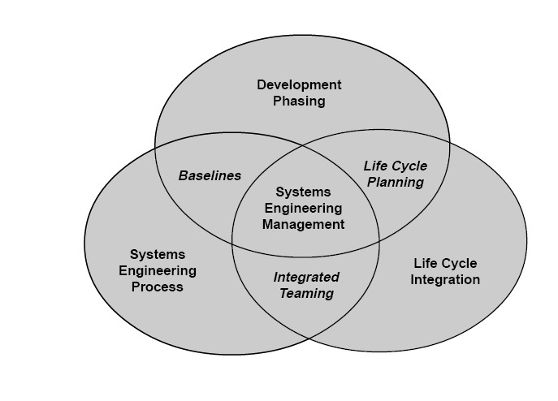
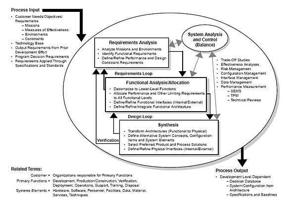

# System Engineering

-[Wiki Page - Systems Engineering](https://en.wikipedia.org/wiki/Systems_engineering)

"System engineering is a robust approach to the design, creation, and operation of systems. In simple terms, the approach consists of identification and quantification of system goals, creation of alternative system design concepts, performance of design trades, selection and implementation of the best design, verification that the design is properly built and integrated, and post-implementation assessment of how well the system meets (or met) the goals."[8] — NASA Systems Engineering Handbook, 1995.

### The scope of systems engineering activities

### The systems engineering process
The systems engineering process encompasses all creative, manual and technical activities necessary to define the product and which need to be carried out to convert a system definition to a sufficiently detailed system design specification for product manufacture and deployment. Design and development of a system can be divided into four stages, each with different definitions:

- task definition (informative definition),
- conceptual stage (cardinal definition),
- design stage (formative definition), and
- implementation stage (manufacturing definition).
- Depending on their application, tools are used for various stages of the systems engineering process

### Related fields and sub-fields
Many related fields may be considered tightly coupled to systems engineering. The following areas have contributed to the development of systems engineering as a distinct entity:

 1. <b>Cognitive systems engineering
 </b>

Cognitive systems engineering (CSE) is a specific approach to the description and analysis of human-machine systems or sociotechnical systems. The three main themes of CSE are how humans cope with complexity, how work is accomplished by the use of artifacts, and how human-machine systems and socio-technical systems can be described as joint cognitive systems. CSE has since its beginning become a recognized scientific discipline, sometimes also referred to as cognitive engineering. The concept of a Joint Cognitive System (JCS) has in particular become widely used as a way of understanding how complex socio-technical systems can be described with varying degrees of resolution. The more than 20 years of experience with CSE has been described extensively.
  1. <b>Configuration management
 </b>

Like systems engineering, configuration management as practiced in the defense and aerospace industry is a broad systems-level practice. The field parallels the taskings of systems engineering; where systems engineering deals with requirements development, allocation to development items and verification, configuration management deals with requirements capture, traceability to the development item, and audit of development item to ensure that it has achieved the desired functionality that systems engineering and/or Test and Verification Engineering have proven out through objective testing.
  1. <b>Control engineering
   </b>

Control engineering and its design and implementation of control systems, used extensively in nearly every industry, is a large sub-field of systems engineering. The cruise control on an automobile and the guidance system for a ballistic missile are two examples. Control systems theory is an active field of applied mathematics involving the investigation of solution spaces and the development of new methods for the analysis of the control process.
  1. <b>Industrial engineering
     </b>

Industrial engineering is a branch of engineering that concerns the development, improvement, implementation and evaluation of integrated systems of people, money, knowledge, information, equipment, energy, material and process. Industrial engineering draws upon the principles and methods of engineering analysis and synthesis, as well as mathematical, physical and social sciences together with the principles and methods of engineering analysis and design to specify, predict, and evaluate results obtained from such systems.
  1. <b>Interface design
       </b>

Interface design and its specification are concerned with assuring that the pieces of a system connect and inter-operate with other parts of the system and with external systems as necessary. Interface design also includes assuring that system interfaces be able to accept new features, including mechanical, electrical and logical interfaces, including reserved wires, plug-space, command codes and bits in communication protocols. This is known as extensibility. Human-Computer Interaction (HCI) or Human-Machine Interface (HMI) is another aspect of interface design, and is a critical aspect of modern systems engineering. Systems engineering principles are applied in the design of network protocols for local-area networks and wide-area networks.
  1. <b>Mechatronic engineering
         </b>

Mechatronic engineering, like systems engineering, is a multidisciplinary field of engineering that uses dynamical systems modeling to express tangible constructs. In that regard it is almost indistinguishable from Systems Engineering, but what sets it apart is the focus on smaller details rather than larger generalizations and relationships. As such, both fields are distinguished by the scope of their projects rather than the methodology of their practice.
  1. <b>Operations research
Operations research supports systems engineering. The tools of operations research are used in systems analysis, decision making, and trade studies. Several schools teach SE courses within the operations research or industrial engineering department,[citation needed] highlighting the role systems engineering plays in complex projects. Operations research, briefly, is concerned with the optimization of a process under multiple constraints.
  1. <b>Performance engineering
           </b>

Performance engineering is the discipline of ensuring a system meets customer expectations for performance throughout its life. Performance is usually defined as the speed with which a certain operation is executed, or the capability of executing a number of such operations in a unit of time. Performance may be degraded when operations queued to execute is throttled by limited system capacity. For example, the performance of a packet-switched network is characterized by the end-to-end packet transit delay, or the number of packets switched in an hour. The design of high-performance systems uses analytical or simulation modeling, whereas the delivery of high-performance implementation involves thorough performance testing. Performance engineering relies heavily on statistics, queueing theory and probability theory for its tools and processes.
  1. <b>Program management and project management
           </b>

Program management (or programme management) has many similarities with systems engineering, but has broader-based origins than the engineering ones of systems engineering. Project management is also closely related to both program management and systems engineering.
  1. <b>Proposal engineering
           </b>

Proposal engineering is the application of scientific and mathematical principles to design, construct, and operate a cost-effective proposal development system. Basically, proposal engineering uses the "systems engineering process" to create a cost effective proposal and increase the odds of a successful proposal.
  1. <b>Reliability engineering
           </b>

Reliability engineering is the discipline of ensuring a system meets customer expectations for reliability throughout its life; i.e., it does not fail more frequently than expected. Next to prediction of failure, it is just as much about prevention of failure. Reliability engineering applies to all aspects of the system. It is closely associated with maintainability, availability (dependability or RAMS preferred by some), and logistics engineering. Reliability engineering is always a critical component of safety engineering, as in failure modes and effects analysis (FMEA) and hazard fault tree analysis, and of security engineering.
  1. <b>Risk Management
           </b>

Risk Management, the practice of assessing and dealing with risk is one of the interdisciplinary parts of Systems Engineering. In development, acquisition, or operational activities, the inclusion of risk in tradeoff with cost, schedule, and performance features, involves the iterative complex configuration management of traceability and evaluation to the scheduling and requirements management across domains and for the system lifecycle that requires the interdisciplinary technical approach of systems engineering. Systems Engineering has Risk Management define, tailor, implement, and monitor a structured process for risk management which is integrated to the overall effort.
  1. <b>Safety engineering
           </b>

The techniques of safety engineering may be applied by non-specialist engineers in designing complex systems to minimize the probability of safety-critical failures. The "System Safety Engineering" function helps to identify "safety hazards" in emerging designs, and may assist with techniques to "mitigate" the effects of (potentially) hazardous conditions that cannot be designed out of systems.
  1. <b>Scheduling
           </b>

Scheduling is one of the systems engineering support tools as a practice and item in assessing interdisciplinary concerns under configuration management. In particular the direct relationship of resources, performance features, and risk to duration of a task or the dependency links among tasks and impacts across the system lifecycle are systems engineering concerns.
  1. <b>Security engineering
           </b>

Security engineering can be viewed as an interdisciplinary field that integrates the community of practice for control systems design, reliability, safety and systems engineering. It may involve such sub-specialties as authentication of system users, system targets and others: people, objects and processes.
  1. <b>Software engineering
           </b>

From its beginnings, software engineering has helped shape modern systems engineering practice. The techniques used in the handling of the complexities of large software-intensive systems have had a major effect on the shaping and reshaping of the tools, methods and processes of Software Engineering.
